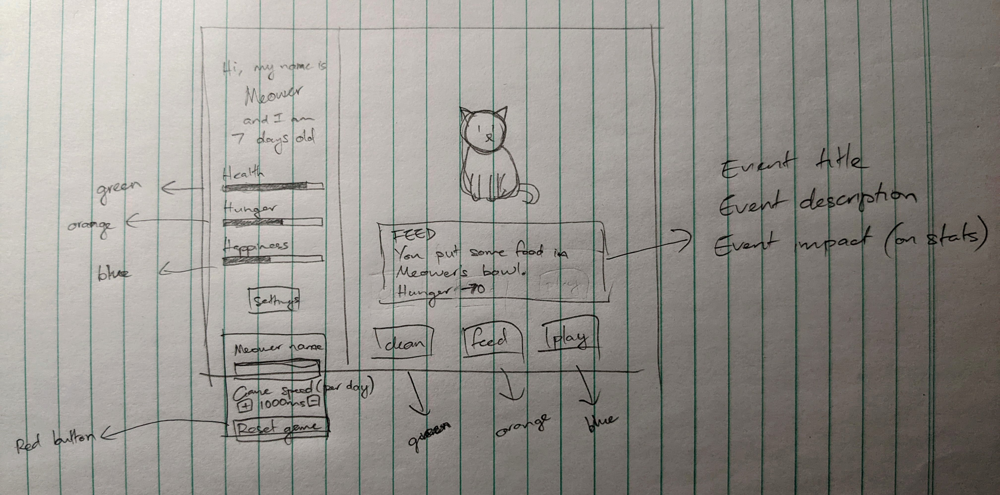

# Hi, I’m Angela! 😄
I'm a **Front End Developer** living in **San Diego, CA**.  
You can send me a message via [LinkedIn](https://linkedin.com/in/angela-sun-flores) 📫 

## 💻 Skills 

- React, JavaScript, CSS, HTML
- I know how to use: Github, VS Code, Figma
- Learning: advanced React, CSS animations

## 🌟 Interests
- Software and mobile app development
- Games and productivity tools
- Hobby projects for smaller communities 

## 💼 Projects
<table border="0">
    <tr>
        <td></td>
        <td>
            
<strong>VIRTUAL MEOWER</strong>

            
<a href="https://comforting-peony-5b904b.netlify.app/">Play the game</a> 
            <a href="https://github.com/valanex/virtual-meow">GitHub repo</a>

            
This virtual pet game is my first non-tutorial solo project. It was built for assessment to join the Chingu Voyage 41 collaborative project.

            This project involved understanding of:
            <ul>
                <li>React</li>
                <li>Fetch API</li>
                <li>setTimeout()</li>
                <li>Bootstrap-React</li>
            </ul>
            
More details about the game itself are available in the <a href="https://github.com/valanex/virtual-meow">GitHub repo</a>. 

        </td>
    </tr>
</table>

<strong>DEVELOPMENT PROCESS</strong>

<table>
    <tr>
        <td width=30%></td>
        <td>
        
<strong>1. The specifications</strong>

        
This project idea was fun, but Chingu was also very specific in what the app needed to have. I wasn't sure how to build all the functions, but I was confident they were buildable. 

        
You can find the specifications on the 
        <a href="https://github.com/chingu-voyages/soloproject-tier2-virtualpet">Chingu Solo Project - Tier 2 - Virtual Pet repo</a>.

        </td>
    </tr>
    <tr>
        <td width=30%></td>
        <td>
        
<strong>2. Creating GIF sprites</strong>

        
Knowing that this would disrupt my momentum later, it was best to begin with the sprites. From the start I envisioned a pixelated cat. I drew one on <a href="https://www.piskelapp.com/">Piskel</a> and created 3 versions: happy, sad, and <i>*cough*</i> dead <i>*cough*</i>.

        </td>
    </tr>
    <tr>
        <td width=30%></td>
        <td>
        
<strong>3. Wireframe</strong>

        
I drew my wireframe on paper because I forgot I had an iPad.

        
The purpose was to make sure I adhered to Chingu's requirements and to decide how to display it all in a comfortably compact interface.

        </td>
    </tr>
    <tr>
        <td width=30%></td>
        <td>
        
<strong>4. Further UI design</strong>

        
Now it was time to see how it looked in <a href="https://www.figma.com/">Figma</a>! This gave me dimensions to work with, and showed just how limited space would be.
 
        
The colors didn't look great, but that could be fixed later.

        </td>
    </tr>
    <tr>
        <td width=30%></td>
        <td>
        
<strong>5. Planning the build</strong>

        
To make it less confusing during the coding process, I typed out the order in which I thought the features and functionality should be built. The list became more detailed as I was coding and really helped break down the complexities into manageable chunks.
 
        </td>
    </tr>
    <tr>
        <td width=30%></td>
        <td>
        
<strong>6. Coding</strong>

        
This took about 10 days overall. I got stuck on how to implement in-game time and then how to stop it counting from day 0 up to day <tt>n</tt> during every in-game day. It turns out that <tt>setTimeout()</tt> is a better choice than <tt>setInterval()</tt>. Overlapping timers was also a multi-day headache.
 
        
I was pushing commits to GitHub at each step in my list.

        </td>
    </tr>
    <tr>
        <td width=30%></td>
        <td>
        
<strong>7. Final touches</strong>

        
After writing my first decent ReadMe, my first thought was that my game was too ugly to deploy. To add a bit of flair, I implemented some visual improvements for a more polished look.

        
Overall, I'm very proud to have built a React app without tutorials! I'm prouder still that Chingu has reviewed and accepted my submission, allowing me to join a collaborative project for Voyage 41.

        </td>
    </tr>
</table>

<!---
valanex/valanex is a ✨ special ✨ repository because its `README.md` (this file) appears on your GitHub profile.
You can click the Preview link to take a look at your changes.
--->
